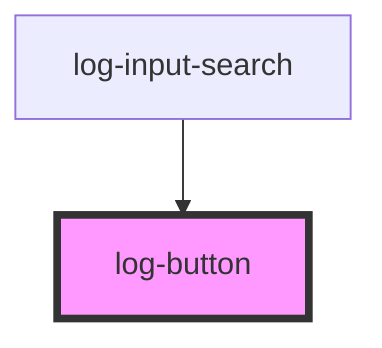

# my-component

<!-- Auto Generated Below -->

## Properties

| Property          | Attribute          | Description | Type      | Default     |
| ----------------- | ------------------ | ----------- | --------- | ----------- |
| `backgroundColor` | `background-color` |             | `string`  | `'primary'` |
| `disable`         | `disable`          |             | `boolean` | `false`     |
| `textColor`       | `text-color`       |             | `string`  | `'light'`   |

## Dependencies

### Used by

 - [log-input-search](../../molecules/log-input-search)

### Graph

----------------------------------------------

*Built with [StencilJS](https://stenciljs.com/)*
