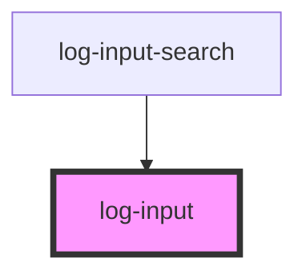

# log-input

<!-- Auto Generated Below -->

## Properties

| Property      | Attribute      | Description | Type      | Default     |
| ------------- | -------------- | ----------- | --------- | ----------- |
| `disabled`    | `disabled`     |             | `boolean` | `false`     |
| `name`        | `name`         |             | `string`  | `undefined` |
| `placeHolder` | `place-holder` |             | `string`  | `''`        |

## Events

| Event        | Description | Type                  |
| ------------ | ----------- | --------------------- |
| `entered`    |             | `CustomEvent<string>` |
| `focused`    |             | `CustomEvent<any>`    |
| `focusedOut` |             | `CustomEvent<any>`    |
| `getValue`   |             | `CustomEvent<string>` |

## Methods

### `getInputRef() => Promise<HTMLInputElement>`

#### Returns

Type: `Promise<HTMLInputElement>`

## Dependencies

### Used by

 - [log-input-search](../../molecules/log-input-search)

### Graph

----------------------------------------------

*Built with [StencilJS](https://stenciljs.com/)*
